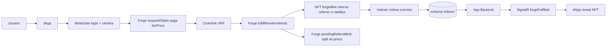
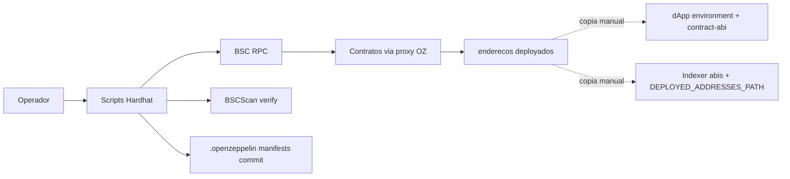
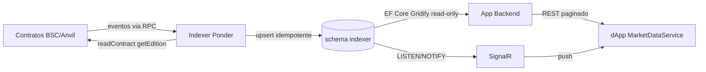
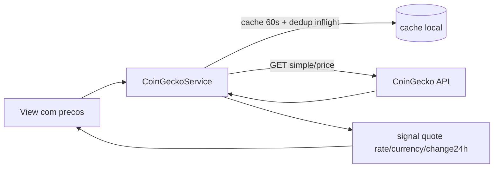

# Fluxos de Dados — Ecossistema BitChicken

Fluxos cross-componente que atravessam mais de um projeto. Cada um traz o gatilho,
se é síncrono/on-chain, um `flowchart` e os passos numerados.

---

## Fluxo 1 — Compra de ovo com indicação

- **Gatilho:** usuário confirma compra de ovo na loja.
- **Natureza:** escrita on-chain (assíncrona via VRF) + leitura off-chain (indexer → API).

1. O `WriteGate` exige login Firebase + carteira vinculada antes de qualquer escrita.
2. O dApp envia `forge.requestObtain(tier, referrerCode, name)` pagando `tierPrice` em BNB.
3. O Forge pede aleatoriedade ao Chainlink VRF e emite `ForgeRequested` (com `requestId`).
4. O VRF retorna `fulfillRandomWords`; o Forge chama `pickEdition` + `forgeMint`.
5. O `forgeMint` deriva gênero do bit menos significativo da palavra e processa o vínculo
   de indicação, retornando `(tokenId, referrer, rateBps)` — não-zero só no 1º ovo do indicado.
6. No sucesso, o Forge reserva `paid * rateBps / 10000` em `pendingReferralBnb` e emite
   `ReferralBnbAccrued`. O Indexer materializa `ForgeFulfilled`, `Minted`, `ReferralLinked` e
   `ReferralBnbAccrued` no schema `indexer`; a API publica `forgeFulfilled` via SignalR ao comprador.
7. O dApp resolve a espera (SignalR; fallbacks: `GET /forge-requests`, polling on-chain).

---

## Fluxo 2 — Deploy / upgrade dos contratos

- **Gatilho:** operador roda `npm run deploy:<rede>` ou `npm run upgrade:<rede>`.
- **Natureza:** síncrono on-chain via Hardhat; propaga manualmente para dApp e indexer.

1. Deploy completo na ordem Token → NFT → Staking → Marketplace → (VRFMock no
   localnet) → Forge; em seguida `setForge`, `grantRole(MINTER_ROLE)`,
   `setEmissionCap`, `updateTierPrices` e registro de edições de exemplo.
2. Upgrade usa `upgradesApi.upgradeProxy` com validação de storage; os manifests
   `.openzeppelin/{bsc,bsc-testnet}.json` devem ser commitados.
3. Verificação opcional na BSCScan via `npm run verify:<rede>`.
4. **Propagação manual (armadilha nº 1):** os novos endereços e qualquer mudança
   de interface precisam ser espelhados em `RW.BC.DApp` (`environment.*.ts` +
   `contract-abi.ts`) **e** em `RW.BC.Indexer` (`abis/*.ts` + endereços). Não há
   geração automática.

---

## Fluxo 3 — Indexação on-chain (read-model)

- **Gatilho:** qualquer evento emitido pelos contratos.
- **Natureza:** assíncrono (stream de eventos), _eventual consistency_.

1. O Ponder escuta eventos dos 5 contratos e, para edições, lê o estado canônico
   via `readContract({ functionName: "getEdition" })` no bloco do evento.
2. Cada handler faz `onConflictDoUpdate` (upsert idempotente) — reindexação é segura.
3. A API lê o schema `indexer` via EF `ToView` (somente leitura) com Gridify
   (filtro/paginação server-side) e nunca expõe estados não-ativos ao cliente.
4. O `MarketplaceEventsListener` detecta mudanças por LISTEN/NOTIFY (fallback
   polling 5 s) e publica `marketChanged`/`forgeFulfilled` via SignalR.

---

## Fluxo 4 — Cotação BNB/fiat (CoinGecko)

- **Gatilho:** qualquer view com preços (loja, marketplace, granja).
- **Natureza:** síncrono off-chain, com cache e degradação graciosa.

1. A moeda fiat é escolhida pelo idioma ativo (en-US → USD, pt-BR → BRL).
2. Cache local de 60 s por moeda; chamadas simultâneas compartilham a mesma
   `Promise` em voo; retry exponencial (3 tentativas).
3. Falha é silenciosa: retorna o último valor cacheado ou `null` — nunca bloqueia
   a renderização de preços em BNB.
