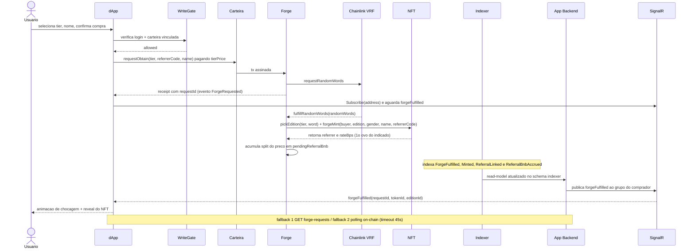

# Mapa de Comunicação — Ecossistema BitChicken

Matriz de integrações entre componentes, protocolos em uso e o diagrama de
sequência do fluxo crítico de compra de ovo (gacha).

## Matriz de integrações

| De → Para | Protocolo | Dados | Sincronia | Criticidade | Fonte |
|---|---|---|---|---|---|
| dApp → Carteira (Reown) | EIP-1193 / WalletConnect v2 | conexão, assinatura, envio de tx | Síncrono | Crítica | `RW.BC.DApp/integracoes.md` |
| dApp → BSC RPC (leitura) | JSON-RPC HTTPS | getters dinâmicos on-chain | Síncrono | Alta | `RW.BC.DApp/integracoes.md` |
| dApp → Contratos (escrita) | JSON-RPC via signer | `requestObtain`, stake, list, obtain, swap | On-chain (assíncrono na confirmação) | Crítica | `RW.BC.DApp/integracoes.md` |
| dApp → Firebase Auth | HTTPS (SDK Web v12) | login/cadastro, idToken | Síncrono | Alta | `RW.BC.DApp/integracoes.md` |
| dApp → API (REST) | HTTPS + Firebase JWT Bearer | contas, listings, NFTs, staking, referral, transparência | Síncrono | Alta | `RW.BC.DApp/integracoes.md` |
| dApp ↔ API (SignalR) | WebSocket | `marketChanged`, `forgeFulfilled` | Assíncrono (push) | Média | `RW.BC.DApp/integracoes.md` |
| dApp → CoinGecko | HTTPS REST | cotação BNB/fiat | Síncrono | Baixa | `RW.BC.DApp/integracoes.md` |
| dApp → Pinata (admin) | HTTPS multipart | upload de arte de edição | Síncrono | Baixa | `RW.BC.DApp/integracoes.md` |
| API → Postgres `public` | TCP / Npgsql (EF) | accounts, wallet_link_nonces | Síncrono | Crítica | `RW.BC.Api/integracoes.md` |
| API → Postgres `indexer` | TCP / Npgsql (EF, read-only) | read-models via Gridify | Síncrono | Alta | `RW.BC.Api/integracoes.md` |
| API → Postgres LISTEN/NOTIFY | TCP / Npgsql (conexão dedicada) | sinal `indexer_live_query` | Assíncrono | Média | `RW.BC.Api/integracoes.md` |
| API → Firebase (OIDC) | HTTPS / JWKS | chaves públicas para validar JWT | Síncrono | Crítica | `RW.BC.Api/integracoes.md` |
| Indexer → BSC RPC | JSON-RPC HTTP/WS | eventos + `readContract` (getEdition) | Assíncrono (stream) | Crítica | `RW.BC.Indexer/integracoes.md` |
| Indexer → Postgres `indexer` | TCP (driver `pg`) | upsert dos read-models | Síncrono | Crítica | `RW.BC.Indexer/integracoes.md` |
| Forge → Chainlink VRF | on-chain (BSC) | `requestRandomWords` / `fulfillRandomWords` | On-chain (callback) | Crítica | `RW.BC.Crypto/integracoes.md` |
| Forge → NFT | chamada de contrato | `pickEdition`, `forgeMint` | On-chain | Crítica | `RW.BC.Crypto/integracoes.md` |
| NFT → BCKN | chamada de contrato | `burnFrom` (rename) | On-chain | Média | `RW.BC.Crypto/integracoes.md` |
| Staking → BCKN | chamada de contrato | `mint` (yield) | On-chain | Alta | `RW.BC.Crypto/integracoes.md` |
| Marketplace → NFT | chamada de contrato | `safeTransferFrom`, `royaltyInfo` | On-chain | Alta | `RW.BC.Crypto/integracoes.md` |
| Scripts Hardhat → BSC RPC | JSON-RPC HTTP | deploy / upgrade / interação | Síncrono | Média | `RW.BC.Crypto/integracoes.md` |
| Scripts Hardhat → BSCScan | REST (etherscan-compat) | verificação de contrato | Síncrono | Baixa | `RW.BC.Crypto/integracoes.md` |

## Protocolos em uso

| Protocolo | Uso | Onde |
|---|---|---|
| JSON-RPC (HTTP/WS) | Leitura/escrita on-chain e indexação | dApp, Indexer, Scripts → BSC/Anvil |
| EIP-1193 / WalletConnect v2 | Conexão e assinatura de carteira | dApp ↔ carteira |
| HTTPS REST + JWT Bearer | API de contas e read-models | dApp → API |
| WebSocket (SignalR) | Notificações em tempo real | dApp ↔ API |
| TCP / Npgsql + driver `pg` | Acesso ao Postgres compartilhado | API e Indexer → Postgres |
| Postgres LISTEN/NOTIFY | Sinal de mudança no read-model | API ↔ Postgres |
| OIDC / JWKS | Descoberta de chaves do Firebase | API → Firebase |
| Chainlink VRF v2.5 | Aleatoriedade verificável (gacha) | Forge ↔ VRF |

## Fluxo crítico — compra de ovo (gacha + indicação)

A recompensa de indicação (**BNB**, fatia do preço do ovo) fica reservada em
`pendingReferralBnb` no Forge; o referrer a saca depois via `claimReferralBnb()` (ver
[dominios/indicacao.md](dominios/indicacao.md)).
