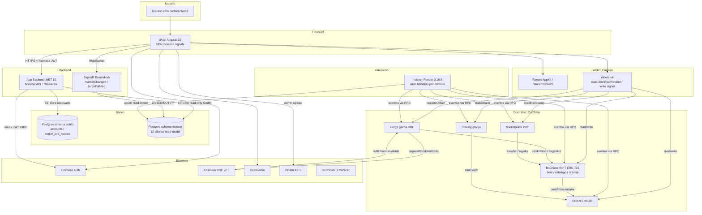

# Visão Geral — Ecossistema BitChicken

Topologia de **4 projetos** organizada por camada. O caminho de leitura é
unidirecional (contratos → indexer → Postgres → API → dApp); o caminho de
escrita on-chain é direto do dApp aos contratos via carteira.

## Componentes por camada

| Camada | Componente | Projeto |
|---|---|---|
| Frontend | dApp Angular | `RW.BC.DApp` |
| Web3 / Carteira | Reown AppKit, ethers v6 | `RW.BC.DApp` |
| Backend | API .NET (REST + SignalR) | `RW.BC.Api` |
| Indexação | Indexer Ponder | `RW.BC.Indexer` |
| Banco | Postgres `public` + `indexer` | compartilhado (API escreve `public`; Ponder escreve `indexer`) |
| Contratos on-chain | BCKN, NFT, Forge, Staking, Marketplace | `RW.BC.Crypto` |
| Serviços externos | Firebase, Chainlink VRF, CoinGecko, Pinata, BSCScan | terceiros |

## Princípios arquiteturais

- **Boundaries rígidos.** Os 4 projetos não compartilham código. Comunicação só
  via **ABI** (contratos↔dApp/indexer), **HTTP + Firebase JWT** (dApp↔API) e
  **schema Postgres compartilhado** (indexer→API).
- **CQRS de leitura off-chain.** Leituras pesadas (NFTs, listings, staking,
  referral, vendas) saem da cadeia: o indexer materializa e a API serve. O dApp
  só lê on-chain dados dinâmicos (`pendingYield`, `nextUnlock`) e config de admin.
- **Escrita sempre on-chain e não-custodial.** Toda mutação de estado (comprar
  ovo, stake, listar, comprar) é tx assinada pela carteira do usuário; a API
  nunca custodia chave nem assina por ele.
- **Identidade federada e desacoplada da carteira.** Conta = Firebase
  (email/senha); carteira vinculada por SIWE (assinatura ECDSA). Login local é
  proibido na API.
- **Upgradeabilidade seletiva.** Token/NFT/Staking/Marketplace são proxies
  transparentes (OZ); o **Forge é imutável** (substituível via `nft.setForge`).
- **ABI mantida à mão (sem geração automática).** Mudar a interface de um
  contrato exige espelhar a ABI no dApp **e** no indexer.

## Dependências críticas

| Dependência | Impacto se cair |
|---|---|
| Chainlink VRF (gacha) | Sem aleatoriedade não há mint de NFT — ovo fica preso em "Chocando…" |
| BSC RPC | Sem RPC não há leitura/escrita on-chain nem indexação |
| Firebase Auth | Sem auth, endpoints protegidos retornam 401 e o write-gate bloqueia escrita |
| Postgres | Sem DB, provisionamento de conta, wallet-link e read-models falham |
| Indexer Ponder | Sem indexer, os read-models ficam desatualizados (API não detecta lag) |
| MINTER_ROLE (Staking) | Sem o papel, o yield do staking não consegue mintar BCKN (a indicação paga em BNB, não minta) |
